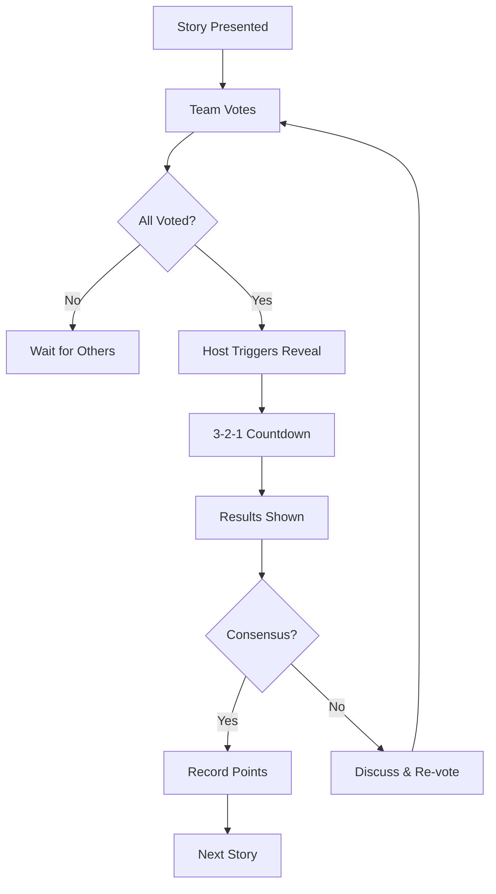

# 🃏 Planning Poker App

**Real-time agile estimation tool for distributed teams**

Planning Poker is a proven technique for agile story point estimation where team members vote simultaneously using Fibonacci numbers to estimate task complexity. This app brings Planning Poker online with real-time collaboration, role-based access, and enhanced features for modern agile teams.


## � What is Planning Poker?

Planning Poker is an agile estimation technique where:
1. **Scrum Master** presents a user story
2. **Team members** vote simultaneously using Fibonacci sequence (1, 2, 3, 5, 8, 13, 21)
3. **Votes are revealed** at the same time to avoid anchoring bias
4. **Discussion** happens about estimates, then re-vote if needed
5. **Consensus** is reached on story points

## ✨ What You Get

### 🏠 **Create & Join Sessions**
- **Room Codes**: Share simple codes for instant team joining
- **Role-Based Access**: Facilitators, Host Participants, and Participants
- **Persistent Sessions**: Rejoin your active sessions anytime

### 🃏 **Smart Voting System**
- **Fibonacci Sequence**: Standard 1, 2, 3, 5, 8, 13, 21, ? cards
- **Skip Voting**: Can't estimate? Skip and return later
- **Real-time Updates**: See who voted instantly

### ⏰ **Reveal with Drama**
- **3-2-1 Countdown**: Builds anticipation before reveal
- **Host Control**: Cancel countdown if needed
- **Simultaneous Reveal**: No anchoring bias

### 📊 **Smart Statistics**
- **Consensus Detection**: See if team agrees
- **Skip Handling**: Proper stats excluding skipped votes
- **Visual Results**: Clear breakdown of all estimates

### � **Team Management**
- **Live Participant List**: See who's in the session
- **Role Badges**: Know who's facilitating vs participating
- **Automatic Cleanup**: Rooms auto-expire after 4 hours

## � How It Works

### **User Flow**
```
1. 📝 Facilitator creates room → Gets room code
2. 👥 Team joins with room code → Choose role  
3. 🃏 Vote on story using Fibonacci cards
4. ⏰ Host triggers 3-2-1 countdown reveal
5. 📊 View results & discuss estimates
6. 🔄 Reset for next story
```

### **Role System**
- **🔵 Facilitator**: Creates room, manages session (doesn't vote)
- **🟢 Host Participant**: Full control + voting capability  
- **🟣 Participant**: Can vote and skip estimation

### **Voting Process**


## 🏗️ Tech Stack

```
Frontend:     React 19.1.1 + Vite
Database:     Firebase Realtime Database  
Styling:      Tailwind CSS
Hosting:      Firebase Hosting
```

## � Local Setup

### Prerequisites
```bash
Node.js 18+ and pnpm
Firebase Project (free tier works)
```

### Quick Start
```bash
# 1. Clone repository
git clone https://github.com/kumarnarendiran2000/Planning-Poker-App.git
cd Planning-Poker-App

# 2. Install dependencies  
pnpm install

# 3. Configure Firebase
cp .env.example .env
# Add your Firebase config to .env

# 4. Start development
pnpm dev
```

### Firebase Setup
1. Go to [Firebase Console](https://console.firebase.google.com/)
2. Create new project
3. Enable **Realtime Database**
4. Get config from **Project Settings > General**
5. Add config to `.env` file

### Environment Variables
```bash
VITE_FIREBASE_API_KEY=your_api_key
VITE_FIREBASE_AUTH_DOMAIN=your_project.firebaseapp.com
VITE_FIREBASE_DATABASE_URL=https://your_project.firebaseio.com
VITE_FIREBASE_PROJECT_ID=your_project_id
VITE_FIREBASE_STORAGE_BUCKET=your_project.appspot.com
VITE_FIREBASE_MESSAGING_SENDER_ID=your_sender_id
VITE_FIREBASE_APP_ID=your_app_id
```

## � User Experience

### **For Scrum Masters**
1. Create room in 10 seconds
2. Share simple room code with team
3. Manage reveals and resets
4. Get instant consensus feedback

### **For Team Members**  
1. Join with room code
2. Vote using familiar Fibonacci cards
3. Skip if can't estimate
4. See real-time team progress

### **For Everyone**
- Works on phone, tablet, desktop
- No app downloads needed
- Rejoin active sessions anytime
- Visual feedback for all actions

## 🎯 Why This App?

### **Solves Real Problems**
- ❌ **Physical cards** → ✅ **Digital voting**
- ❌ **Zoom fatigue** → ✅ **Focused estimation**  
- ❌ **Anchoring bias** → ✅ **Simultaneous reveals**
- ❌ **Complex tools** → ✅ **Simple room codes**
- ❌ **Lost sessions** → ✅ **Persistent rooms**

### **Built for Remote Teams**
- Real-time sync across timezones
- No account creation required
- Works on any device
- Handles network interruptions gracefully

## 📄 License

MIT License - Use freely for commercial or personal projects.

## 👨‍💻 Author

**Kumar Narendiran** - [GitHub](https://github.com/kumarnarendiran2000)

---

*Making agile estimation simple for distributed teams* 🌍