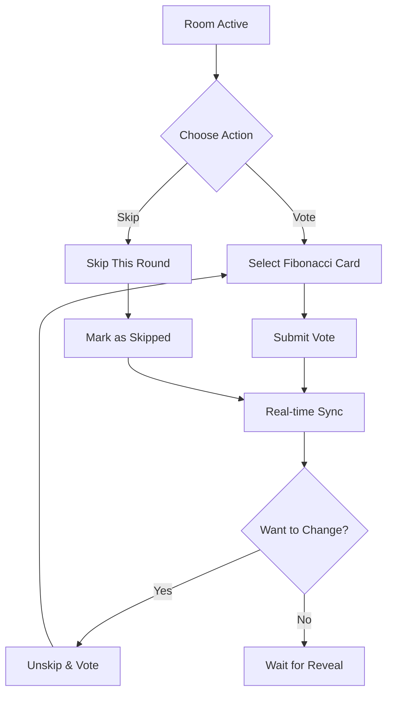
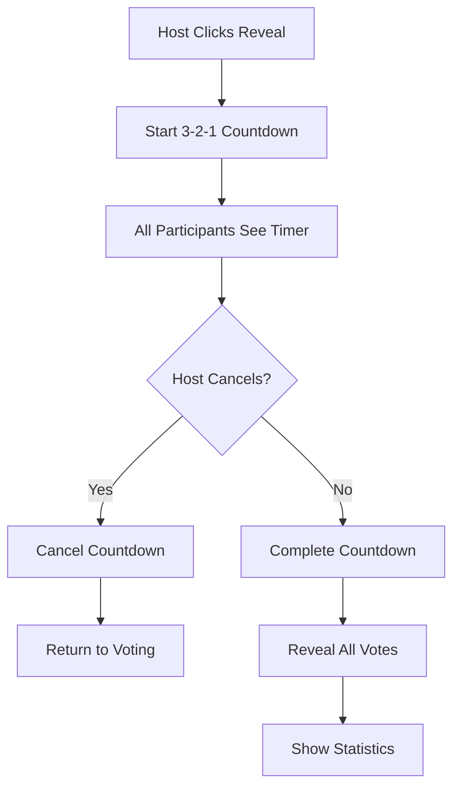
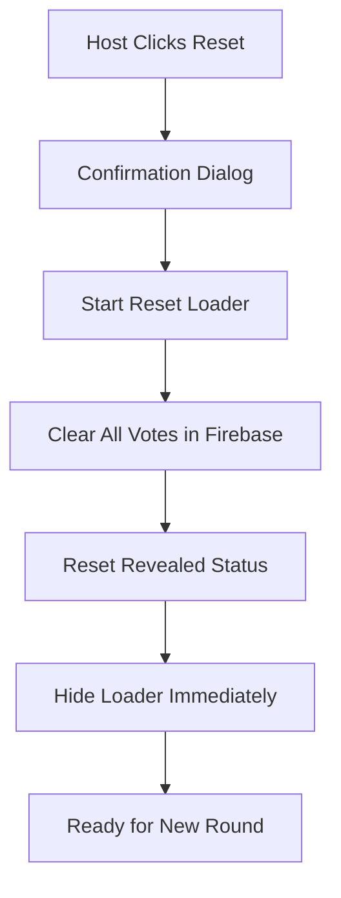
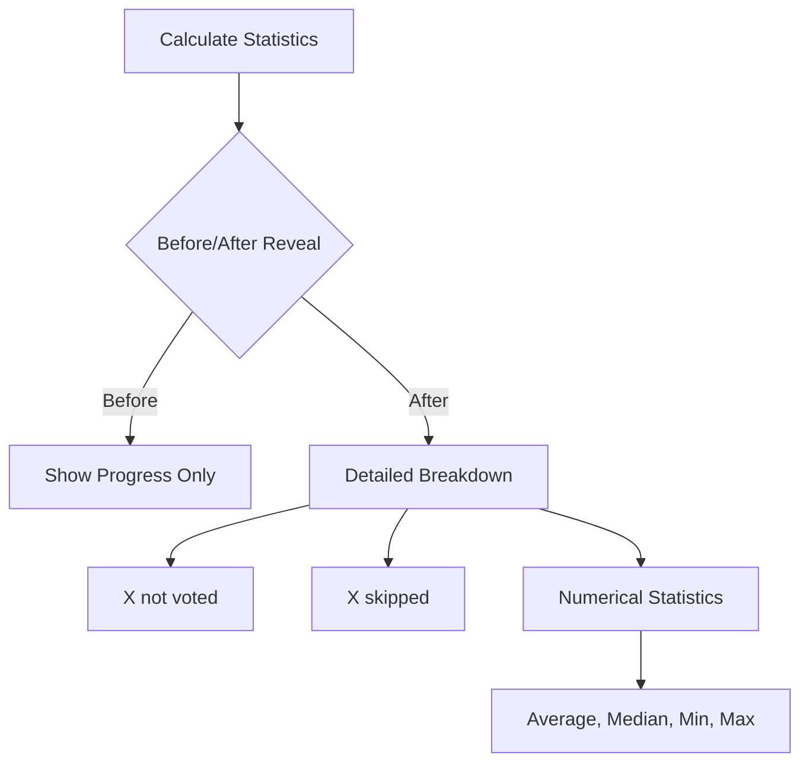

# 🃏 Planning Poker App# 🃏 Planning Poker App# 🃏 Planning Poker App


Production-ready real-time Planning Poker application for distributed agile teams.


Production-ready real-time Planning Poker application for distributed agile teams.A comprehensive real-time Planning Poker application built with React and Firebase, designed to enhance agile estimation processes for distributed teams. Features advanced functionality including countdown timers, vote skipping, enhanced statistics, and robust session management.


## ✨ Key Features


- **Role-Based Access**: Facilitators (Blue), Host Participants (Green), Participants (Purple)

- **Advanced Voting**: Fibonacci sequence + Skip/Unskip functionality  

- **Countdown Reveals**: 3-2-1 timer with host cancellation

- **Smart Statistics**: Role-aware calculations excluding skipped votes

- **Enhanced Reset**: Real-time loading with immediate completion feedback

- **Session Management**: Persistent sessions with homepage role badges

## ✨ Key Features

## 🏗️ Tech Stack

## 🚀 Features

```

Frontend:     React 19.1.1 + Vite- **Role-Based Access**: Facilitators (Blue), Host Participants (Green), Participants (Purple)

Database:     Firebase Realtime Database  

Styling:      Tailwind CSS- **Advanced Voting**: Fibonacci sequence + Skip/Unskip functionality  ### Core Functionality

Hosting:      Firebase Hosting

State:        Custom Hooks + React Context- **Countdown Reveals**: 3-2-1 timer with host cancellation- **🏠 Create Rooms**: Facilitators can create unique Planning Poker sessions with role-based access

```

- **Smart Statistics**: Role-aware calculations excluding skipped votes- **👥 Join Sessions**: Participants can join using room codes with persistent session management

## 🎮 User Flow

- **Enhanced Reset**: Real-time loading with immediate completion feedback- **🃏 Fibonacci Voting**: Complete Fibonacci sequence (1, 2, 3, 5, 8, 13, 21, ?) with unknown estimation support

### **Roles**

- **🔵 Facilitator**: Room management only (no voting)- **Session Management**: Persistent sessions with homepage role badges- **⏭️ Skip/Unskip Voting**: Participants can skip rounds and return to voting seamlessly

- **🟢 Host Participant**: Full control + voting capability  

- **🟣 Participant**: Voting + skip functionality- **⏰ Reveal Countdown**: 3-2-1 countdown timer before vote reveal with host-cancelable functionality


### **Voting Process**## 🏗️ Tech Stack- **📊 Real-time Updates**: Instant synchronization across all participants via Firebase Realtime Database

1. **Vote**: Select Fibonacci (1,2,3,5,8,13,21,?) or Skip

2. **Reveal**: Host triggers 3-2-1 countdown → auto-reveal- **🎯 Controlled Reveals**: Host manages when to reveal votes with visual countdown

3. **Statistics**: View results excluding skipped participants

4. **Reset**: Clear votes with real-time loading```- **📈 Advanced Statistics**: Comprehensive stats with proper handling of skipped votes and non-participants


## 🛠️ SetupFrontend:     React 19.1.1 + Vite- **🔄 Enhanced Reset**: Smooth reset experience with loading indicators and real-time feedback


### PrerequisitesDatabase:     Firebase Realtime Database  - **👑 Role-Based Controls**: Distinct roles for Facilitators, Host Participants, and Participants

```bash

Node.js 18+, pnpm, Firebase ProjectStyling:      Tailwind CSS

```

Hosting:      Firebase Hosting### User Experience Enhancements

### Quick Start

```bashState:        Custom Hooks + React Context- **📱 Responsive Design**: Seamless experience across desktop, tablet, and mobile devices

git clone https://github.com/kumarnarendiran2000/Planning-Poker-App.git

cd Planning-Poker-App/planning-poker-app```- **🎨 Modern UI**: Clean, intuitive interface with cohesive purple/indigo theme and smooth animations

pnpm install

- **🔔 Smart Notifications**: Enhanced toast system with contextual feedback and proper error handling

# Configure Firebase

cp .env.example .env## 🎮 User Flow- **💾 Session Persistence**: Automatic session management with localStorage and active session tracking

# Add Firebase config to .env

- **⚡ Real-time Sync**: Firebase-powered real-time updates with race condition prevention

pnpm dev              # Development

pnpm deploy:hosting   # Deploy### **Roles**- **🚪 Graceful Exit**: Intelligent cleanup when users leave sessions with proper role handling

```

- **🔵 Facilitator**: Room management only (no voting)- **📋 Active Sessions Panel**: Homepage display of all active sessions with role badges

### Environment Variables

```bash- **🟢 Host Participant**: Full control + voting capability  - **🛡️ Production Ready**: Cleaned console logs, comprehensive error handling, and optimized performance

VITE_FIREBASE_API_KEY=your_api_key

VITE_FIREBASE_AUTH_DOMAIN=your_project.firebaseapp.com- **🟣 Participant**: Voting + skip functionality

VITE_FIREBASE_DATABASE_URL=https://your_project.firebaseio.com

VITE_FIREBASE_PROJECT_ID=your_project_id### Advanced Features

VITE_FIREBASE_STORAGE_BUCKET=your_project.appspot.com

VITE_FIREBASE_MESSAGING_SENDER_ID=your_sender_id### **Voting Process**- **🔐 Session Management**: Unique session IDs with role distinction (Facilitator/Host Participant/Participant)

VITE_FIREBASE_APP_ID=your_app_id

```1. **Vote**: Select Fibonacci (1,2,3,5,8,13,21,?) or Skip- **👨‍💼 Role-Based Privileges**: 


## 📚 API Reference2. **Reveal**: Host triggers 3-2-1 countdown → auto-reveal  - **Facilitators**: Room management only (no voting)


### Core Methods3. **Statistics**: View results excluding skipped participants  - **Host Participants**: Full control including voting

```javascript

// Voting4. **Reset**: Clear votes with real-time loading  - **Participants**: Voting and skip functionality

await RoomService.submitVote(roomId, participantId, value)

await RoomService.skipVote(roomId, participantId)- **📊 Smart Statistics**: Post-reveal breakdown showing "X not voted" vs "X skipped" participants

await RoomService.unskipVote(roomId, participantId)

## 🛠️ Setup- **🛡️ Error Handling**: Comprehensive error management with user-friendly feedback

// Countdown & Reveal

await RoomService.startCountdown(roomId)- **🧹 Auto Cleanup**: Automatic room cleanup with 4-hour lifecycle management

await RoomService.cancelCountdown(roomId)

await RoomService.revealVotes(roomId)### Prerequisites- **📋 Session Tracking**: Visual role badges on homepage (Facilitator/Host Participant/Participant)


// Reset```bash- **� State Synchronization**: Race condition prevention with Firebase-first state management

await RoomService.startResetState(roomId)

await RoomService.resetVotes(roomId)Node.js 18+, pnpm, Firebase Project- **ℹ️ Educational Content**: Comprehensive app information and Planning Poker guidance

await RoomService.stopResetState(roomId)

``````


### Hooks---

```javascript

const { participants, revealed, countdown, resetState } = useRoomState(roomId)### Quick Start

const { vote, handleVote, handleSkip, handleUnskip } = useVoting(...)

const sessions = getActiveSessions() // [{roomId, userName, isHost, isParticipant}]```bash## 🏗️ Architecture

```

git clone https://github.com/kumarnarendiran2000/Planning-Poker-App.git

## 🔧 Key Configuration

cd Planning-Poker-App/planning-poker-app### Tech Stack

```javascript

// Fibonacci sequencepnpm install```

export const FIBONACCI_SEQUENCE = ['1', '2', '3', '5', '8', '13', '21', '?'];

Frontend:     React 19.1.1 + Vite 7.1.2

// Role badges

facilitator: 'bg-blue-100 text-blue-700',      // Blue# Configure FirebaseStyling:      Tailwind CSS 3.4.17

hostParticipant: 'bg-green-100 text-green-700', // Green  

participant: 'bg-purple-100 text-purple-700'    // Purplecp .env.example .envDatabase:     Firebase Realtime Database

```

# Add Firebase config to .envRouting:      React Router DOM 7.8.2

## 🧪 Testing Priorities

Notifications: React Hot Toast 2.6.0

- ✅ Room creation → Joining → Voting → Reveal cycle

- ✅ Skip/Unskip during active votingpnpm dev              # DevelopmentState:        Custom Hooks + React Context

- ✅ Countdown with host cancellation

- ✅ Role-based statistics accuracypnpm deploy:hosting   # DeployBuild:        Vite with ESBuild optimization

- ✅ Session persistence across refresh

```Linting:      ESLint 9.33.0

## 🚀 Deployment

Hosting:      Firebase Hosting

```bash

pnpm deploy:hosting  # One-command Firebase deployment### Environment Variables```

```

```bash

## 🤝 Contributing

VITE_FIREBASE_API_KEY=your_api_key### Project Structure

Contributions are welcome! Please feel free to submit a Pull Request. For major changes, please open an issue first to discuss what you would like to change.

VITE_FIREBASE_AUTH_DOMAIN=your_project.firebaseapp.com```

### Development Guidelines

- Follow the existing code styleVITE_FIREBASE_DATABASE_URL=https://your_project.firebaseio.comsrc/

- Add tests for new features

- Update documentation as neededVITE_FIREBASE_PROJECT_ID=your_project_id├── 📁 components/           # React components

- Ensure all tests pass before submitting

VITE_FIREBASE_STORAGE_BUCKET=your_project.appspot.com│   ├── 📁 Room/            # Room-specific components

## 📄 License

VITE_FIREBASE_MESSAGING_SENDER_ID=your_sender_id│   │   ├── index.jsx       # Main room container

This project is licensed under the MIT License - see the [LICENSE](LICENSE) file for details.

VITE_FIREBASE_APP_ID=your_app_id│   │   ├── VotingCards.jsx # Fibonacci voting interface

### What this means:

- ✅ **Free to use** for personal and commercial projects```│   │   ├── ParticipantList.jsx # Real-time participant display

- ✅ **Modify** and distribute the code

- ✅ **Include copyright notice** in your copies│   │   ├── StatisticsPanel.jsx # Vote statistics & progress

- ✅ **No warranty** - use at your own risk

## 📚 API Reference│   │   └── HostControls.jsx # Host-only controls

## 👨‍💻 Author

│   ├── 📁 modals/          # Modal dialogs

**Kumar Narendiran**  

GitHub: [@kumarnarendiran2000](https://github.com/kumarnarendiran2000)  ### Core Methods│   │   ├── NameModal.jsx   # User name input

Email: kumarnarendiran2000@gmail.com

```javascript│   │   ├── DeleteRoomModal.jsx # Room deletion confirmation

## 🙏 Acknowledgments

// Voting│   │   └── AlertModal.jsx  # General purpose alerts

- React team for the amazing framework

- Firebase for real-time database capabilitiesawait RoomService.submitVote(roomId, participantId, value)│   └── 📁 common/          # Shared components

- Tailwind CSS for excellent utility-first styling

- The open source community for inspirationawait RoomService.skipVote(roomId, participantId)│       ├── Modal.jsx       # Base modal component


---await RoomService.unskipVote(roomId, participantId)│       ├── RevealCountdown.jsx # 3-2-1 countdown timer


*Built with ❤️ for agile teams worldwide*│       └── ResetLoader.jsx # Reset loading animation

// Countdown & Reveal├── 📁 hooks/               # Custom React hooks

await RoomService.startCountdown(roomId)│   ├── useRoom.js          # Room state management

await RoomService.cancelCountdown(roomId)│   ├── useVoting.js        # Voting logic & statistics

await RoomService.revealVotes(roomId)│   ├── useRoomState.js     # Room data subscription

│   └── useRoomSubscription.js # Firebase listeners

// Reset├── 📁 services/            # API services

await RoomService.startResetState(roomId)│   └── roomService.js      # Firebase operations abstraction

await RoomService.resetVotes(roomId)├── 📁 utils/               # Utility functions

await RoomService.stopResetState(roomId)│   ├── constants.js        # App constants & Fibonacci sequence

```│   ├── localStorage.js     # Session persistence utilities

│   └── statistics.js       # Vote calculation algorithms

### Hooks├── 📁 firebase/            # Firebase configuration

```javascript│   └── config.js          # Firebase initialization

const { participants, revealed, countdown, resetState } = useRoomState(roomId)└── 📁 assets/              # Static assets

const { vote, handleVote, handleSkip, handleUnskip } = useVoting(...)```

const sessions = getActiveSessions() // [{roomId, userName, isHost, isParticipant}]

```### Key Components & Features


## 🔧 Key Configuration#### **🎯 Core Components**

- **`RevealCountdown`**: 3-2-1 countdown with host cancel functionality

```javascript- **`ResetLoader`**: Loading animation during vote reset operations

// Fibonacci sequence- **`VotingCards`**: Fibonacci sequence voting with skip/unskip capabilities

export const FIBONACCI_SEQUENCE = ['1', '2', '3', '5', '8', '13', '21', '?'];- **`StatisticsPanel`**: Comprehensive statistics with proper role handling

- **`ParticipantList`**: Real-time participant tracking with role badges

// Role badges- **`ActiveSessions`**: Homepage session management with role indicators

facilitator: 'bg-blue-100 text-blue-700',      // Blue

hostParticipant: 'bg-green-100 text-green-700', // Green  #### **🔗 Custom Hooks**

participant: 'bg-purple-100 text-purple-700'    // Purple- **`useRoom`**: Core room state management and Firebase integration

```- **`useVoting`**: Voting logic, statistics calculation, and race condition prevention

- **`useRoomState`**: Room data subscription and state synchronization

## 🧪 Testing Priorities- **`useRoomSubscription`**: Firebase real-time listeners management


- ✅ Room creation → Joining → Voting → Reveal cycle#### **🛠️ Services & Utils**

- ✅ Skip/Unskip during active voting- **`RoomService`**: Firebase operations with countdown, reset, and skip functionality

- ✅ Countdown with host cancellation- **`localStorage`**: Session persistence with role tracking (isHost, isParticipant)

- ✅ Role-based statistics accuracy- **`statistics`**: Advanced vote calculations excluding skipped participants

- ✅ Session persistence across refresh- **`enhancedToast`**: Production-ready notification system


## 🚀 Deployment---


```bash## 🎯 Complete User Flow & New Features

pnpm deploy:hosting  # One-command Firebase deployment

```### 1. 🏠 Enhanced Homepage Experience


## 📄 License#### **Active Sessions Management**

```mermaid

MIT License - see [LICENSE](LICENSE) file.graph TD

    A[Homepage] --> B[Display Active Sessions]

## 👨‍💻 Author    B --> C[Show Role Badges]

    C --> D[Facilitator - Blue Badge]

**Kumar Narendiran**      C --> E[Host Participant - Green Badge]

GitHub: [@kumarnarendiran2000](https://github.com/kumarnarendiran2000)    C --> F[Participant - Purple Badge]

    B --> G[Quick Join Session]

---    B --> H[Leave Session]

```

*Built with ❤️ for agile teams worldwide*
**Test Scenarios:**
- ✅ Display all active sessions with correct role badges
- ✅ Quick join functionality from homepage
- ✅ Proper role distinction (Facilitator vs Host Participant vs Participant)
- ✅ Session cleanup when leaving from homepage

### 2. 🃏 Enhanced Voting Flow with Skip/Unskip

#### **Advanced Voting Process**


**New Features:**
- ✅ Skip voting for any round
- ✅ Unskip and return to voting
- ✅ Proper statistics excluding skipped participants
- ✅ Visual indicators for skipped vs voted vs pending states

### 3. ⏰ Countdown Reveal System

#### **Reveal with Countdown**


**Features:**
- ✅ 3-second countdown before reveal
- ✅ Visual countdown for all participants
- ✅ Host-only cancel functionality
- ✅ Smooth animation and real-time sync

### 4. 🔄 Enhanced Reset Experience

#### **Smart Reset with Loading**


**Improvements:**
- ✅ Immediate loader dismissal when reset completes
- ✅ No artificial delays - responsive to actual completion
- ✅ Real-time loading state for all participants
- ✅ Proper cleanup of all vote states

### 5. 📊 Advanced Statistics Panel

#### **Comprehensive Stats Display**


**Enhanced Features:**
- ✅ Proper role-based participant counting
- ✅ Exclude facilitators from voting statistics
- ✅ Distinguish "not voted" vs "skipped" in post-reveal stats
- ✅ Accurate average calculation excluding skipped votes
## 🧪 Comprehensive Testing Matrix

### 🎯 New Features Testing

| Feature | Happy Path ✅ | Edge Cases ⚠️ | Error Cases ❌ |
|---------|---------------|----------------|----------------|
| **Countdown Reveal** | Host starts → 3-2-1 → Reveal | Host cancels mid-countdown | Network issues during countdown |
| **Skip/Unskip Voting** | Skip → Unskip → Vote normally | Rapid skip/unskip changes | Skip during reveal process |
| **Reset Loader** | Reset → Loader → Immediate hide | Multiple reset attempts | Firebase failure during reset |
| **Role Badges** | Correct badge display | Role changes during session | Missing localStorage data |
| **Enhanced Statistics** | Proper counting logic | All users skip | Mixed roles and votes |

### 📊 Functional Testing Matrix

| Feature | Happy Path ✅ | Edge Cases ⚠️ | Error Cases ❌ |
|---------|---------------|----------------|----------------|
| **Room Creation** | Valid host name → Room created | Very long names, special chars | Empty name, Firebase down |
| **Room Joining** | Valid code + name → Joined | Case sensitivity, spaces | Invalid code, room deleted |
| **Fibonacci Voting** | Select card → Vote recorded | Rapid vote changes | Vote after reveal |
| **Statistics** | Mixed votes → Correct stats | All ?, all same value | No votes, invalid data |
| **Session Management** | Join → Persist → Leave | Refresh, multiple tabs | Network issues |
| **Role Management** | Proper role assignment | Role conflicts | Invalid role data |

### 🔄 State Management Testing

#### **Race Condition Prevention**
- ✅ Firebase-first state updates
- ✅ Concurrent voting handling
- ✅ Simultaneous skip/unskip operations
- ✅ Multiple reset attempts
- ✅ Real-time synchronization accuracy

#### **Session Persistence**
- ✅ localStorage role tracking (isHost, isParticipant)
- ✅ Browser refresh maintains session
- ✅ Multiple tabs same user handling
- ✅ Active sessions display accuracy

### 📱 Device & Browser Testing

#### **Desktop Testing**
- ✅ Chrome (latest) - All features
- ✅ Firefox (latest) - Countdown animations
- ✅ Safari (latest) - Firebase real-time sync
- ✅ Edge (latest) - Role badge display

#### **Mobile Testing**
- ✅ iOS Safari - Touch interactions for skip/vote
- ✅ Android Chrome - Countdown visibility
- ✅ Responsive breakpoints - Statistics panel layout
- ✅ Touch interactions - Enhanced voting cards

#### **Network Conditions**
- ✅ High-speed connection - All features optimal
- ✅ Slow 3G simulation - Graceful degradation
- ✅ Intermittent connectivity - State recovery
- ✅ Offline → Online recovery - Session restoration

### 🚨 Production-Ready Error Handling

#### **Firebase Operations**
- ❌ Database unavailable during countdown
- ❌ Authentication failures
- ❌ Rate limiting during rapid operations
- ❌ Invalid configuration

#### **User Input Validation**
- ❌ SQL injection attempts
- ❌ XSS script injection
- ❌ Very long input strings
- ❌ Unicode/emoji handling

#### **Concurrent User Scenarios**
- 👥 Multiple users skip simultaneously
- 🔄 Countdown during network partition
- 🏠 Host leaves during countdown
- 📊 Reset during active voting

---

## 🛠️ Development Setup

### Prerequisites
```bash
Node.js 18+ 
pnpm (recommended) or npm
Firebase Project
```

### Installation
```bash
# Clone repository
git clone https://github.com/kumarnarendiran2000/Planning-Poker-App.git
cd Planning-Poker-App/planning-poker-app

# Install dependencies
pnpm install

# Setup environment
cp .env.example .env
# Edit .env with your Firebase configuration
```

### Environment Configuration
```bash
# Required Firebase variables
VITE_FIREBASE_API_KEY=your_api_key
VITE_FIREBASE_AUTH_DOMAIN=your_project.firebaseapp.com
VITE_FIREBASE_DATABASE_URL=https://your_project.firebaseio.com
VITE_FIREBASE_PROJECT_ID=your_project_id
VITE_FIREBASE_STORAGE_BUCKET=your_project.appspot.com
VITE_FIREBASE_MESSAGING_SENDER_ID=your_sender_id
VITE_FIREBASE_APP_ID=your_app_id
```

### Development Commands
```bash
# Start development server
pnpm dev

# Build for production
pnpm build

# Preview production build
pnpm preview

# Lint code
pnpm lint
```

---

## 🚀 Deployment

### Firebase Hosting
```bash
# Install Firebase CLI
npm install -g firebase-tools

# Login to Firebase
firebase login

# Initialize hosting
firebase init hosting

# Build and deploy
pnpm build
firebase deploy
```

### Vercel Deployment
```bash
# Install Vercel CLI
npm install -g vercel

# Deploy
vercel --prod
```

---

## 🎨 UI/UX Features

### Visual Design
- **🎨 Modern Card Design**: Glassmorphism effects
- **🌈 Color Coding**: Success (green), Error (red), Warning (amber)
- **📱 Responsive Layout**: Mobile-first approach
- **🎯 Interactive Elements**: Hover states, click feedback
- **🔄 Loading States**: Skeleton screens, spinners

### Accessibility
- ♿ WCAG 2.1 AA compliance
- ⌨️ Keyboard navigation
- 📢 Screen reader support
- 🎨 High contrast support
- 📏 Scalable text sizes

### Performance
- ⚡ < 2s initial load time
- 🔄 Real-time updates < 100ms
- 💾 Efficient state management
- 🗜️ Optimized bundle size
- 📱 60fps animations

---

## 🔧 Configuration & Customization

### Fibonacci Voting Options
```javascript
// utils/constants.js - Planning Poker card values
export const FIBONACCI_SEQUENCE = ['1', '2', '3', '5', '8', '13', '21', '?'];

// '?' represents "Unknown" - when participants need more information
// Different from "Skip" - which excludes participation in the round
```

### Role-Based System Configuration
```javascript
// localStorage.js - Role management
export const isUserHost = (roomId) => {
  return localStorage.getItem(`${PREFIX}isHost_${roomId}`) === 'true';
};

export const isUserParticipant = (roomId) => {
  return localStorage.getItem(`${PREFIX}isParticipant_${roomId}`) === 'true';
};

// Role combinations:
// Facilitator: isHost=true, isParticipant=false (manages but doesn't vote)
// Host Participant: isHost=true, isParticipant=true (manages and votes)
// Participant: isHost=false, isParticipant=true (votes only)
```

### Countdown & Animation Settings
```javascript
// RevealCountdown.jsx - Countdown configuration
const COUNTDOWN_DURATION = 3; // 3 seconds countdown
const ANIMATION_DELAY = 1000; // 1 second between numbers

// ResetLoader.jsx - Reset loader settings
const LOADER_ANIMATION_SPEED = '1.5s'; // Spinner rotation speed
```

### Enhanced Toast Configuration
```javascript
// Enhanced toast system with contextual styling
const TOAST_DURATION = 15000; // 15 seconds display time
const SUCCESS_STYLE = 'bg-green-500'; // Success notifications
const ERROR_STYLE = 'bg-red-500'; // Error notifications
const WARNING_STYLE = 'bg-amber-500'; // Warning notifications
```

### Firebase Real-time Configuration
```javascript
// Firebase database rules for production security
{
  "rules": {
    "rooms": {
      ".read": true,
      "$roomId": {
        ".write": true,
        ".validate": "newData.hasChildren(['participants'])",
        "participants": {
          "$participantId": {
            ".validate": "newData.hasChildren(['name', 'sessionId'])"
          }
        },
        "countdown": {
          ".validate": "newData.hasChildren(['active'])"
        },
        "resetState": {
          ".validate": "newData.hasChildren(['active'])"
        }
      }
    }
  }
}
```

### Statistics Calculation Logic
```javascript
// utils/statistics.js - Enhanced statistics with role awareness
export const calculateStatistics = (participants) => {
  // Exclude facilitators (isParticipant=false) from voting statistics
  // Separate "not voted" from "skipped" in post-reveal breakdown
  // Handle edge cases: all ?, mixed numeric/special values
  
  const votingParticipants = Object.values(participants)
    .filter(p => p.isParticipant !== false);
    
  const numericVotes = votingParticipants
    .map(p => p.vote)
    .filter(vote => vote && vote !== 'SKIP' && vote !== '?' && !isNaN(vote))
    .map(Number);
    
  return {
    average: numericVotes.length > 0 ? 
      (numericVotes.reduce((a, b) => a + b, 0) / numericVotes.length).toFixed(1) : 'N/A',
    median: calculateMedian(numericVotes),
    min: numericVotes.length > 0 ? Math.min(...numericVotes) : 'N/A',
    max: numericVotes.length > 0 ? Math.max(...numericVotes) : 'N/A'
  };
};
```

### Role Badge Styling
```javascript
// ActiveSessions.jsx - Role badge color scheme
const ROLE_BADGES = {
  facilitator: 'bg-blue-100 text-blue-700',      // Blue for facilitators
  hostParticipant: 'bg-green-100 text-green-700', // Green for host participants  
  participant: 'bg-purple-100 text-purple-700'    // Purple for participants
};
```

---

## 🐛 Troubleshooting

### Common Issues

#### **Room Not Loading**
- ✅ Check Firebase configuration
- ✅ Verify internet connection
- ✅ Check browser console for errors

#### **Votes Not Syncing**
- ✅ Refresh the page
- ✅ Check Firebase database rules
- ✅ Verify room still exists

#### **Session Lost**
- ✅ Clear localStorage and rejoin
- ✅ Check if room was deleted
- ✅ Verify stable internet connection

### Debug Mode
```bash
# Enable Firebase debug logging
localStorage.debug = 'firebase:*'
```

---

## 📚 API Reference & Component Documentation

### RoomService Methods
```javascript
// Core room operations
await RoomService.checkRoomExists(roomId)
await RoomService.getRoomData(roomId)
await RoomService.createRoom(roomId, roomData)
await RoomService.deleteRoom(roomId)
await RoomService.deleteRoomIfEmpty(roomId)

// Participant operations
await RoomService.addParticipant(roomId, participantId, data)
await RoomService.removeParticipant(roomId, participantId)

// Enhanced voting operations
await RoomService.submitVote(roomId, participantId, value)
await RoomService.skipVote(roomId, participantId)     // New: Skip functionality
await RoomService.unskipVote(roomId, participantId)   // New: Unskip functionality
await RoomService.revealVotes(roomId)
await RoomService.resetVotes(roomId)

// New: Countdown system
await RoomService.startCountdown(roomId)              // Start 3-2-1 countdown
await RoomService.cancelCountdown(roomId)             // Host cancel countdown
await RoomService.completeCountdown(roomId)           // Complete countdown

// New: Reset state management
await RoomService.startResetState(roomId)             // Show reset loader
await RoomService.stopResetState(roomId)              // Hide reset loader

// Utility operations
await RoomService.clearResetNotification(roomId)
```

### Custom Hooks
```javascript
// Enhanced room management
const {
  loading, roomExists, participants, revealed,
  showNameModal, userName, sessionId, isHost,
  joinRoom, deleteRoom, countdown, resetState     // New: countdown & resetState
} = useRoom(roomId, alertFunctions)

// Advanced voting logic with skip/unskip
const {
  vote, handleVote, handleReveal, handleReset, 
  handleSkip, handleUnskip, stats,              // New: skip/unskip methods
  executeReveal, cancelCountdown                // New: countdown methods
} = useVoting(roomId, sessionId, participants, revealed, isHost)

// Real-time state subscription
const {
  participants, revealed, countdown, resetState
} = useRoomState(roomId)

// Firebase listener management
const roomData = useRoomSubscription(roomId)
```

### Component Props & Usage

#### **RevealCountdown Component**
```javascript
<RevealCountdown
  isVisible={!!countdown?.active}    // Show when countdown active
  onComplete={executeReveal}         // Execute reveal when countdown ends
  onCancel={cancelCountdown}         // Cancel countdown (host only)
  showCancelButton={isHost}          // Only show cancel for hosts
/>
```

#### **ResetLoader Component**
```javascript
<ResetLoader
  isVisible={!!resetState?.active}  // Show during reset operations
/>
```

#### **VotingCards with Skip/Unskip**
```javascript
<VotingCards
  values={FIBONACCI_SEQUENCE}       // ['1', '2', '3', '5', '8', '13', '21', '?']
  vote={vote}                       // Current user's vote
  onVote={handleVote}               // Handle voting
  onSkip={handleSkip}               // Handle skip action
  onUnskip={handleUnskip}           // Handle unskip action
  revealed={revealed}               // Whether votes are revealed
  disabled={revealed}               // Disable voting after reveal
/>
```

#### **Enhanced StatisticsPanel**
```javascript
<StatisticsPanel
  participants={participants}       // All room participants
  vote={vote}                      // Current user's vote
  revealed={revealed}              // Reveal status
  totalParticipants={totalCount}   // Total participant count
  votesSubmitted={votedCount}      // Votes submitted count
  isVotingComplete={allVoted}      // All participants voted
  stats={stats}                    // Calculated statistics
/>
```

### LocalStorage Session Management
```javascript
// Enhanced session utilities with role tracking
import { 
  getUserName, setUserName,
  getSessionId, setSessionId,
  isUserHost, setUserHost,
  isUserParticipant, setUserParticipant,
  getActiveSessions,              // New: Get all active sessions with roles
  getSessionForRoom,              // Check existing session
  clearRoomData                   // Clean up session data
} from './utils/localStorage.js';

// Example usage:
const sessions = getActiveSessions();
// Returns: [{ roomId, userName, sessionId, isHost, isParticipant }]
```

### Error Handling Patterns
```javascript
// Production-ready error handling with enhanced toasts
try {
  await RoomService.submitVote(roomId, sessionId, value);
  enhancedToast.success('Vote submitted successfully!');
} catch (error) {
  console.error('Error submitting vote:', error);
  enhancedToast.error('Failed to submit vote: ' + error.message);
}

// Countdown error handling
try {
  await RoomService.startCountdown(roomId);
} catch (error) {
  console.error('Error starting countdown:', error);
  // Graceful fallback - immediate reveal
  await RoomService.revealVotes(roomId);
}
```

---

## 🤝 Contributing

### Development Workflow
1. Fork the repository
2. Create feature branch (`git checkout -b feature/amazing-feature`)
3. Commit changes (`git commit -m 'Add amazing feature'`)
4. Push to branch (`git push origin feature/amazing-feature`)
5. Open Pull Request

### Code Standards
- ✅ ESLint configuration enforced
- ✅ Consistent naming conventions
- ✅ JSDoc comments for functions
- ✅ React best practices
- ✅ Performance optimization

---

## 📄 License

This project is licensed under the MIT License - see the [LICENSE](LICENSE) file for details.

---

## 👨‍💻 Author

**Kumar Narendiran**
- GitHub: [@kumarnarendiran2000](https://github.com/kumarnarendiran2000)
- LinkedIn: [Kumar Narendiran](https://linkedin.com/in/kumarnarendiran2000)

---

## 🙏 Acknowledgments

- React team for the amazing framework
- Firebase for real-time database
- Tailwind CSS for utility-first styling
- Vite for lightning-fast development
- React Hot Toast for notifications

---

*Built with ❤️ for agile teams worldwide*
